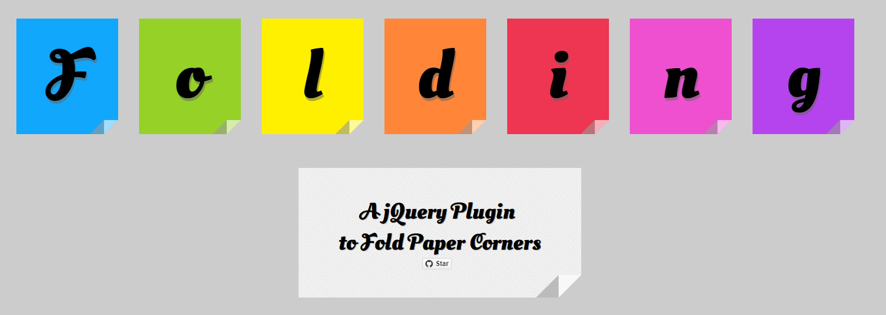

## **项目介绍**

- ✌这是一个**jQuery插件**，可以在右下角创建平面设计的纸张折叠效果，这对于时尚和链接提示都很有用。
- 它使用CSS边框技巧来实现效果，而不使用任何图像，这使我们能够创建任何大小的角落。了解如何实现这一目标。😁

### **如何使用**
要使用Folding，应始终包含以下文件。

    
    

HTML: 

    

JS:

    $('#paper').Folding();

假设我们想在HTML中为带有id纸的元素添加一个角，Folding使它变得如此简单：

### **项目大小**

大小只有1.2kb😍

### **项目预览**

